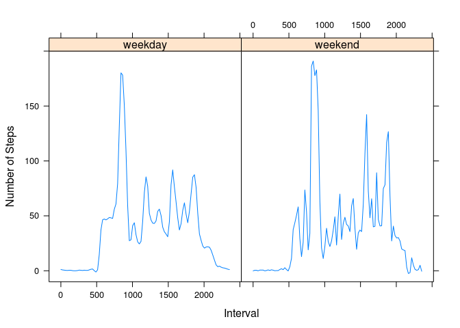

# Reproducible Research: Peer Assessment 1


## Loading and preprocessing the data

```r
act<-read.csv("activity.csv")
head(act)
```

```
##   steps       date interval
## 1    NA 2012-10-01        0
## 2    NA 2012-10-01        5
## 3    NA 2012-10-01       10
## 4    NA 2012-10-01       15
## 5    NA 2012-10-01       20
## 6    NA 2012-10-01       25
```
For the moment, no preprocessing of the data is needed.

## Total number of steps per day
For the following part, I ignore the missing values


```r
actNoNan<-act[complete.cases(act),]
```

### Histogram of the total number of steps per day


```r
sumday<-tapply(actNoNan$steps, actNoNan$date, sum)
hist(sumday, xlab="Total number of steps per day", main="Histogram of the total number of steps per day")
```

 

### Mean and median total number of steps taken per day

```r
mean(sumday, na.rm=TRUE)
```

```
## [1] 10766.19
```

```r
median(sumday, na.rm=TRUE)
```

```
## [1] 10765
```


## Average daily activity pattern

### Time series plot of the 5-minute interval and the average number of steps taken, averaged across all days


```r
meanPattern<-tapply(actNoNan$steps, actNoNan$interval, mean)
plot(names(meanPattern), meanPattern,type="l", xlab="Interval", ylab="Mean number of steps", main="Average daily pattern")
```

 

### 5-minute interval, on average across all the days in the dataset, containing the maximum number of steps

```r
names(which.max(meanPattern))
```

```
## [1] "835"
```

## Imputing missing values

### Total number of missing values in the dataset (i.e. the total number of rows with NAs)

```r
nrow(act[!complete.cases(act),])
```

```
## [1] 2304
```

### Create a new dataset that is equal to the original dataset but with the missing data filled in.

The strategy chosen for filling the dataset is to assign to each missing value the mean for the corresponding 5-minute interval.


```r
actfull<-act
actfull[is.na(act)] <- meanPattern
```


### Histogram of the total number of steps taken each day for the completed dataset


```r
sumdayfull<-tapply(actfull$steps, actfull$date, sum)
hist(sumdayfull, xlab= "Total number of steps per day", main="Histogram of the total number of steps per day")
```

 

The histogram appears to be very similar to the previous one. The strategy chosen for filling in the dataset does not change significantly the estimates of the total daily number of steps.

### Mean and median total number of steps taken per day for the filled dataset


```r
mean(sumdayfull)
```

```
## [1] 10766.19
```

```r
median(sumdayfull)
```

```
## [1] 10766.19
```

Also these estimates are not changed by the filling of the missing values in the dataset.

## Differences in activity patterns between weekdays and weekends

### Creation of a new factor variable in the dataset with two levels – “weekday” and “weekend” indicating whether a given date is a weekday or weekend day.

```r
actfull$day<-as.factor(weekdays(as.Date(levels(actfull$date))))
actfull$weekend<-as.factor(ifelse(actfull$day == "sabato" | actfull$day == "domenica","weekend", "weekday"))
```

### Panel plot containing a time series plot of the 5-minute interval and the average number of steps taken, averaged across all weekday days or weekend days. 

I've chosen to use the lattice package to make the following plot.


```r
library(lattice)
xyplot(steps~interval|weekend, data=actfull, type="spline", ylab="Number of Steps", xlab="Interval", ylim=c(-10, 200))
```

 
